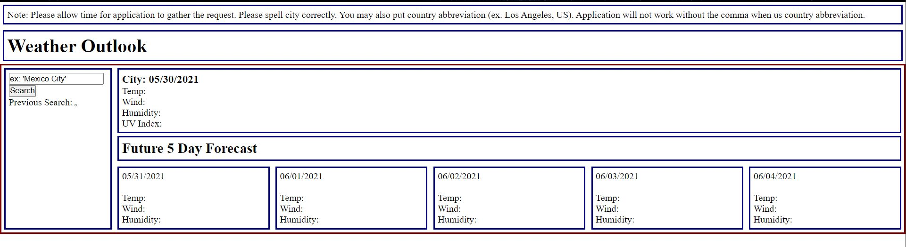

# Weather Application

**Version 1.0.0**

## Test Your Knowledge

    This application is aimed at sharing with its user the current weather along with the 5 day forecast. User must spell out the city they are searching for correctly to get a response. Users are also allowed to put at abbreviation for the country along with the city to get a more precise update.

## Img

   

## Built With...

    JAVASCRIPT
    HTML
    CSS

    openweathermap API
    MOMENT.JS API

## Contributor

    Richie Tauch

## Website Link

[Weather App](https://rumtikitum.github.io/WeatherApp/)